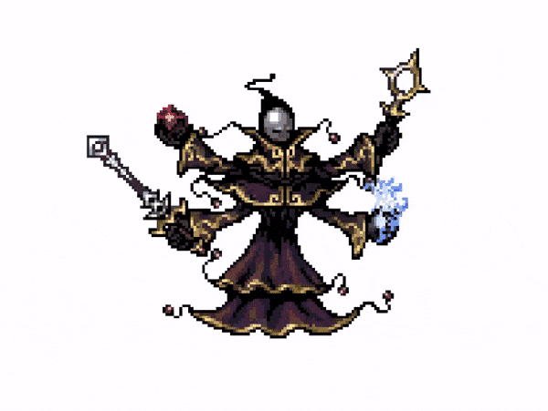

# Cutting sprites in Unity programmatically

I've made a post explaining this setup [here](https://acadev.hashnode.dev/cutting-sprites-in-unity-programmatically).

## Credits

- The character animation was made by [Balmer](https://opengameart.org/content/bosses-and-monsters-spritesheets-ars-notoria).
- [Sprite.Create docs](https://docs.unity3d.com/ScriptReference/Sprite.Create.html).
